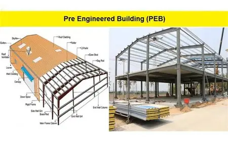

<html>
<head>
  <title>SLM Freelance Construction Company</title>
  
</head>
<body>

  <header>
    <h1>Welcome to SLM Freelance Construction Company</h1>
    
Reliable and affordable building solutions – Quality you can trust!

  </header>

  <section>
    <h2>About Us</h2>
    
We are a dedicated freelance construction team with new ideas for residential and commercial projects. Our mission is to deliver top-quality work, on time and within budget.

  </section>

  <section>
    <h2>Our Services</h2>
    <ul>
      <li>Building Construction</li>
      <li>Home Renovation</li>
      <li>PEB Building</li>
      <li>Plumbing & Electrical</li>
      <li>Painting & Interior Work</li>
      <li>Site Cleaning & Finishing</li>
      <li>Land Surveying</li>
    </ul>
  </section>
  <section>
  <h2>Our Projects</h2>
  
  
  
</section>

  <section>
    <h2>Contact Us</h2>
    
📞 Phone: +91-7093831070

    
📧 Email: SLMfreelance@email.com

    
📍 Location: Hyderabad, Telangana

  </section>

  <footer>
    
&copy; 2025 Freelance Construction Co. | Building your dreams, brick by brick

  </footer>

</body>
</html>
